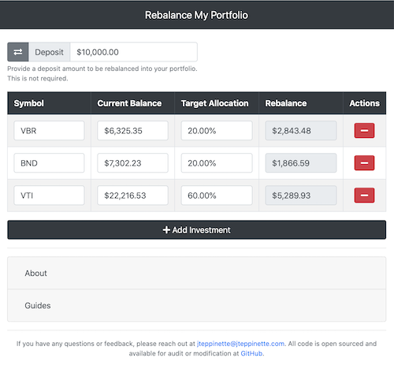

# Rebalance My Portfolio

[](https://app.netlify.com/sites/rebalance-my-portfolio/deploys)
[](https://github.com/jteppinette/rebalance-my-portfolio/actions/workflows/pre-commit.yml)



## Development

### Required Software

- [direnv](https://direnv.net)
- [git](https://git-scm.com/)
- [node](https://nodejs.org/en/download/)
- [pre-commit](https://pre-commit.com/#install)

### Getting Started

**Setup**

```sh
$ direnv allow
$ pre-commit install
$ npm install
```

**Watch & Serve**

```sh
$ npm run dev
```

### Build

```sh
$ npm run build
```
